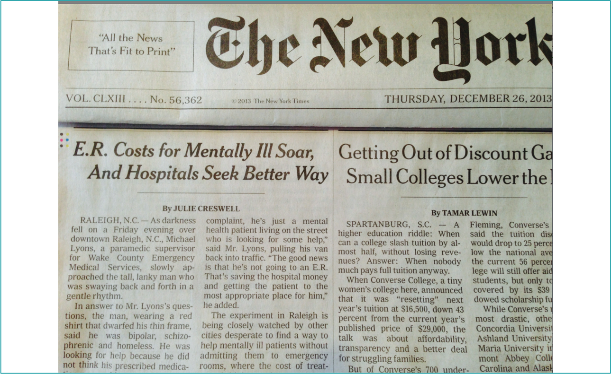
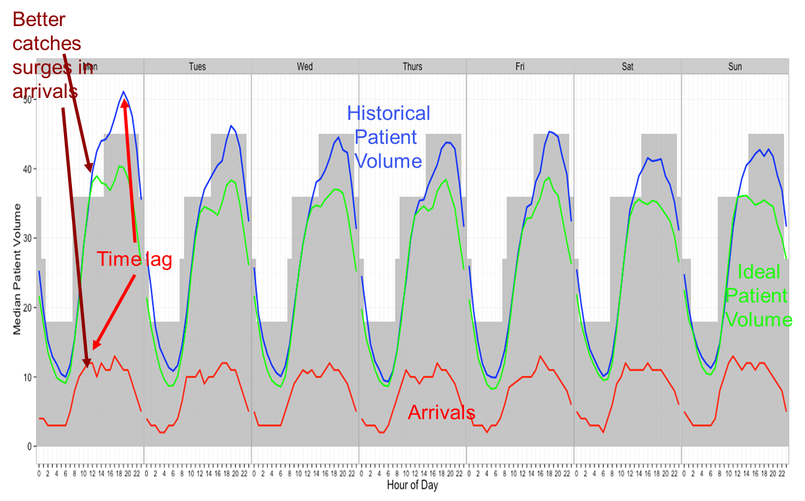
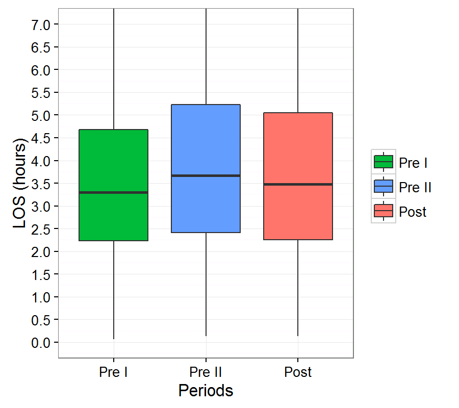
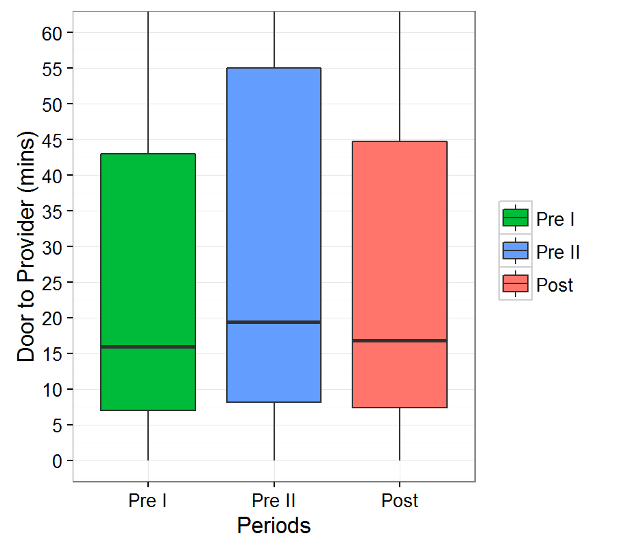
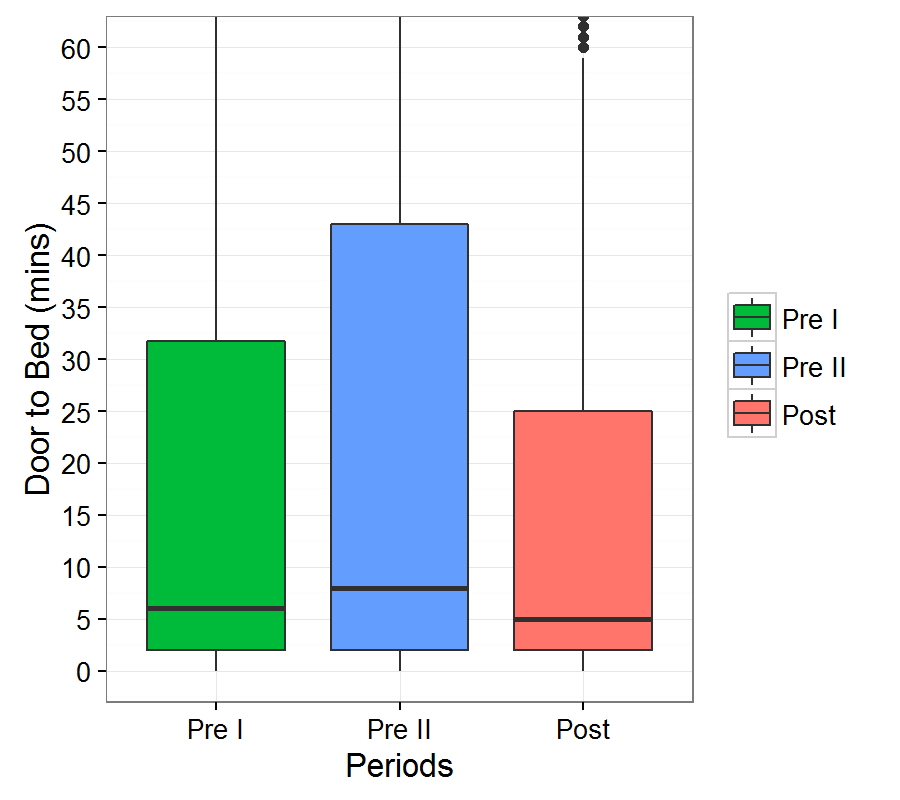
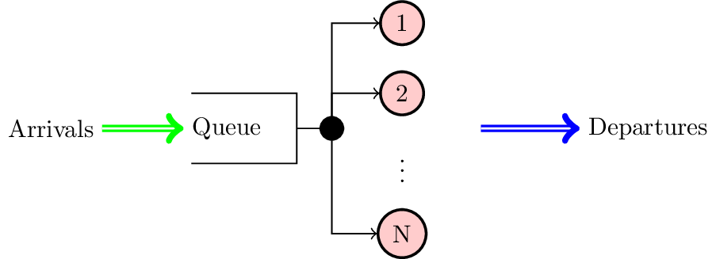
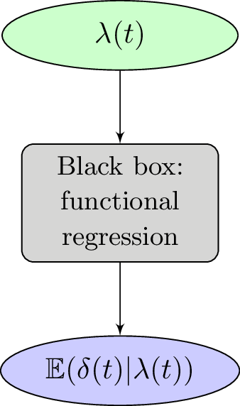
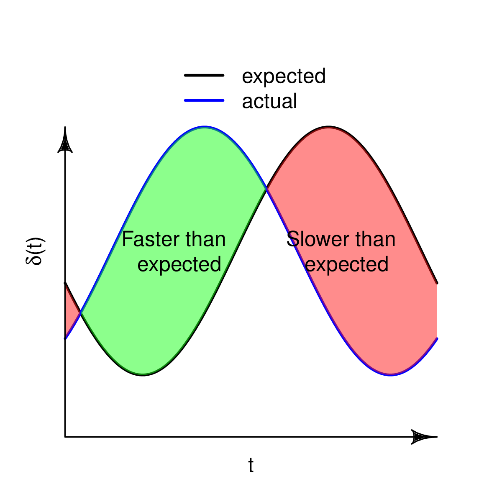

<!-- .slide: data-background="cover1.png", data-background-size="cover", align="left" -->
#  Data analytics for improving the practice of emergency medicine 
## Devashish Das
### April 13, 2017

---

# Outline

1. Emergency Department - Clinical Engineering Learning Lab
2. Data driven staffing and scheduling
3. Statistical learning and statistical monitoring of daily operations
4. Other projects

---

# Emergency room overcrowding

---

# Mayo Clinic's Emergency Department

- Level 1 Trauma center
- 80,000 patients per year

---

# Mayo Clinic's philosophy

*The best interest of the patient* is the only interest to be considered, and in order that the sick may have the benefit of advancing knowledge, **union of forces is necessary**. - William J. Mayo, 1910 

---

# ED - CELL
## Emergency Department - Clinical Engineering Learning Lab

- Emergency Department --- Physicians, Nurses, Residents
- Kern Center, Health care systems engineering -- Scientists, Engineers
- Analysts, IT professionals

---

# Data driven staffing and scheduling

---

# Matching capacity to demand

---

# Building the new staffing model

* Use CART trees to find 'ideal patient volume'
* MIP formulation to match staffing and 'ideal patient volume'

---

# Optimized staffing

---

# Results

1. Time periods compared
	- Pre I: December 2013 -- May 2014
	- Pre II: December 2014 -- May 2015
	- Post: December 2015 -- May 2016

---

# Results

---

# Highlights

- Coordinated across multiple disciplines (MD/DO, APP, Nursing/PCA, CTA)
- Patient-centered and data-driven (volume/acuity based)
- FTE neutral
- Wagner Prize finalist, INFORMS 2016 (Paper to appear in *Interfaces*)

---

# Monitor ED operations 

- Motivation --- When do reevaluate staffing?
- Use length of stay (a Center of Medicare and MedicaidServices metric)?
- Is there a systematic statistical monitoring method for acomplex service system that
	* Detects deterioration in fow of patients
	* Detects cause of deterioration
	* Accounts for time inhomogeneity
	* Is data driven

---

# Statistical learning and statistical monitoring framework for ED operations

---

# Stochastic models for service systems

- Stochastic models: Poisson processes, renewal theory
- Queue metrics: Waiting times, queue length
- Asymptotic and approximate analysis

---

# Limitation of existing research

- Time inhomogeneous queues: Eick et al (1998), Ibrahim and Whitt (2009), Liu and Whitt(2014) ...

- Limitations:
    * Lack of statistical learning models
    * Lack of statistical monitoring algorithms

---

# Statistical learning framework

- Example: (1) Classify email as spam (2) Enhance weather predictions 
- Statistical learning framework
    + If $f(x)$ cannot be established from physics of the process
    + $  \hat{f} = \arg\min\_{f} \sum_{i \in \mathcal{I}\_0}\mathbb{L}(y\_i - f(x_i))$
- $\mathbb{L}$ -- loss function, $\mathcal{I}\_0$ -- training data set </li>

---

# Statistical learning framework for service systems

 

---

# Statistical learning framework for service systems

 

---

# Functional regression framework

* Departure rate at time $t$ is predicted by arrivals occurring from $t-\mathcal{T}$ to $t$
* $\mathbb{E}(\delta(t)|\lambda(t)) = \sum\_{s=(t-\mathcal{T})}^{t} \beta\_{s,t}$
<!-- *  = \sum_{s=(t-\mathcal{T})}^{t} \beta_{s,t}\lambda(s)$ -->

 
 

---

# Functional regression framework

* Departure rate at time $t$ is predicted by arrivals occurring from $t-\mathcal{T}$ to $t$
* $\mathbb{E}(\delta(t)|\lambda(t)) = \int\_{(t-\mathcal{T})}^{t} \beta(s,t)\lambda(s)ds$

 

---

# Estimation of coefficient function

$\min\_{\beta} \sum\_{i \in \mathcal{I}\_0} \int_0^T \left( {\hat{\delta}\_i(t)} - {\mathbb{E} (\hat{\delta}\_i(t)|\hat{\lambda}\_i(t))} \right)^2 dt$

$=\min\_{\beta} \sum\_{i \in \mathcal{I}\_0} \int_0^T \left( {\hat{\delta}\_i(t)} - {\int\_{0 \vee (t-\mathcal{T})}^t \beta(s,t) \hat{\lambda}\_i(s) ds} \right)^2 dt$

* Challenges
    - Computation
    - Nonnegative intensity function
    - Avoid over-fitting

---

# Statistical monitoring framework

- Generate alarm when $\left|\left| \hat{\delta} - \mathbb{E}\left({\delta}| \hat{\lambda}\right) \right|\right|_2 \geq \text{threshold}$

---

# Simulation studies

- Phase I of SPC scheme
    + Collect the arrival and departure time instance, $\tau\_{i,j}$ and $\nu\_{i,j}$, when the system was in-control. 
    + Estimate $\beta(s,t)$.
    + Monitoring statistic $e_i = \int\_0^T \left(\hat{\delta}\_i(t) - \int \hat{\beta}(s,t) \hat{\lambda}\_i(s) ds\right)^2dt$ for in-control sample
    + Either use simulation or bootstrapping to estimate $h$ such that $\mathbb{P} (e_i > h) = \alpha$
- Phase II of SPC scheme
    + Collect test sample $i\in \mathcal{I}\_1$.
    + If $e_i \geq h$ sample $i$ is out of control

---

## Inhomogeneous arrival rates with stochastic intensity

- Simulate queues with time varying arrival
- Arriving entities experience time varying service time distributions
- Compare
    + FR chart - Functional regression based monitoring scheme; SH chart - Shewhart chart; IS chart - exact method for infinite server queues

---

# Simulation studies results

###  Type II error rate - $M\_t/M/\infty$ ($\mu_0 = 1\;\text{hours})$

---

# Simulation studies results

###  Type II error rate - $M\_t/M_t/\infty$ ($\mu_0 = 1\;\text{hours})$

---

# Real data case study

<figcaption>March 2014, Functional regression based chart</figcaption>

---

# Real data case study

<figcaption>March 2014, Shewhart chart</figcaption>

---

# Real data case study

<figcaption>Analyzing March 21</figcaption>

---

# Highlights

- Statistical inference of stochastic service  systems
    + Statistical learning method for service system
    + Detecting multiple patterns of change in service
- Future extension
    + Asymptotic properties of the functional regression scheme
    + Real-time detection

