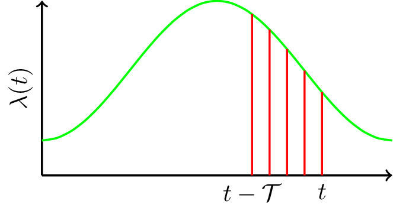

#  Data analytics for improving the practice of emergency medicine {data-background=cover1.png data-background-size=cover align=left}
## Devashish Das
### April 13, 2017

# Outline

1. Emergency Department - Clinical Engineering Learning Lab
2. Data driven staffing and scheduling
3. Statistical learning and statistical monitoring of daily operations
4. Other projects

# Emergency room overcrowding

# Mayo Clinic's Emergency Department

- Level 1 Trauma center
- 80,000 patients per year

# Mayo Clinic's philosophy

"**The best interest of the patient is** the only interest to be considered, and in order that the sick may have the benefit of advancing knowledge, **union of forces is necessary**." - William J. Mayo, 1910 

# ED - CELL

## Emergency Department - Clinical Engineering Learning Lab

- Emergency Department --- Physicians, Nurses, Residents
- Kern Center, Health care systems engineering -- Scientists, Engineers
- Analysts, IT professionals

# Data driven staffing and scheduling

# Matching capacity to demand

# Building the new staffing model

* Use CART trees to find 'ideal patient volume'
* MIP formulation to match staffing and 'ideal patient volume'

# Optimized staffing

# Results

1. Time periods compared
    - Pre I: December 2013 – May 2014
    - Pre II: December 2014 – May 2015
    - Post: December 2015 – May 2016

# Results

# Highlights

- Coordinated across multiple disciplines (MD/DO, APP, Nursing/PCA, CTA)
- Patient-centered and data-driven (volume/acuity based)
- FTE neutral
- Wagner Prize finalist, INFORMS 2016 (Paper to appear in *Interfaces*)

# Monitor ED operations 

- Motivation --- When do reevaluate staffing?
- Use length of stay (a Center of Medicare and MedicaidServices metric)?
- Is there a systematic statistical monitoring method for acomplex service system that
    * Detects deterioration in fow of patients
    * Detects cause of deterioration
    * Accounts for time inhomogeneity
    * Is data driven

# Statistical learning and statistical monitoring framework for ED operations

# Stochastic models for service systems

- Stochastic models: Poisson processes, renewal theory
- Queue metrics: Waiting times, queue length
- Asymptotic and approximate analysis

# Limitation of existing research

- Time inhomogeneous queues — Eick et al (1998), Ibrahim and Whitt (2009), Liu and Whitt(2014) ...

- Limitations:
    * Lack of statistical learning models
    * Lack of statistical monitoring algorithms

# Statistical learning framework

- Example: (1) Classify email as spam (2) Enhance weather predictions
- Statistical learning framework
    + If $f(x)$ cannot be established from physics of the process
    + $$  \hat{f} = \arg\min_{f} \sum_{i \in \mathcal{I}_0}\mathbb{L}(y_i - f(x_i))$$
- $\mathbb{L}$ -- loss function, $\mathcal{I}_0$ -- training data set

# Statistical learning framework for service systems

 

# Statistical learning framework for service systems

 

# Functional regression framework

* Departure rate at time $t$ is predicted by arrivals occurring from $t-\mathcal{T}$ to $t$
* $\mathbb{E}(\delta(t)|\lambda(t)) = \sum_{s=(t-\mathcal{T})}^{t} \beta_{s,t}\lambda(s)$

 
 

# Functional regression framework

* Departure rate at time $t$ is predicted by arrivals occurring from $t-\mathcal{T}$ to $t$
* $\mathbb{E}(\delta(t)|\lambda(t)) = \int_{(t-\mathcal{T})}^{t} \beta(s,t)\lambda(s)ds$

 

# Estimation of coefficient function

* $$\min_{\beta} \sum_{i \in \mathcal{I}_0} \int_0^T \left( {\hat{\delta}_i(t)} - {\mathbb{E} (\hat{\delta}_i(t)|\hat{\lambda}_i(t))} \right)^2 dt$$
$$=\min_{\beta} \sum_{i \in \mathcal{I}_0} \int_0^T \left( {\hat{\delta}_i(t)} - {\int_{0 \vee (t-\mathcal{T})}^t \beta(s,t) \hat{\lambda}_i(s) ds} \right)^2 dt$$

* Challenges
    - Computation
    - Nonnegative intensity function
    - Avoid over-fitting

# Statistical monitoring framework

- Generate alarm when $\left|\left| \hat{\delta} - \mathbb{E}\left({\delta}| \hat{\lambda}\right) \right|\right|_2 \geq \text{threshold}$

